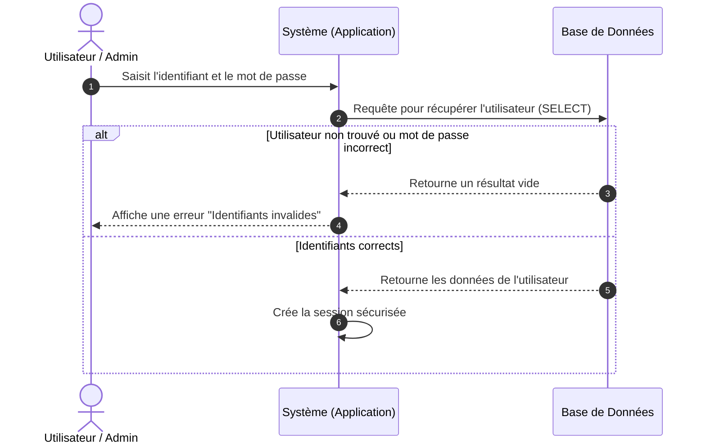

# Diagrammes de Séquence (Avec Base de Données)

Ces diagrammes mettent en évidence les interactions classiques entre l'utilisateur, l'application (Système) et le stockage (Base de données).

## 1. Authentification (Connexion au système)

