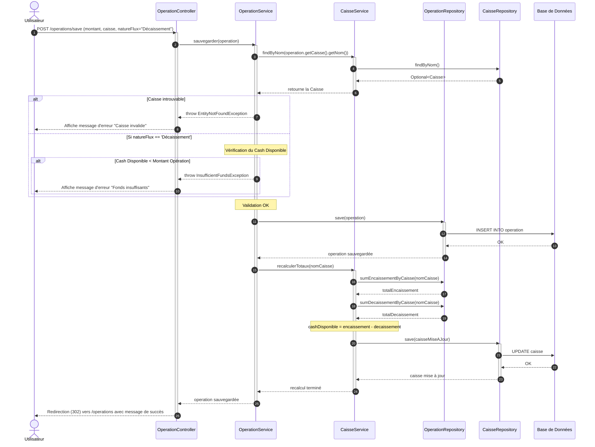

# Diagramme de Séquence : Ajout d'une Opération de Trésorerie

Ce document présente le flux d'interactions lors de la création d'une nouvelle opération de trésorerie (comme un décaissement) incluant les validations métier et le recalcul automatique des totaux de la caisse impactée.

